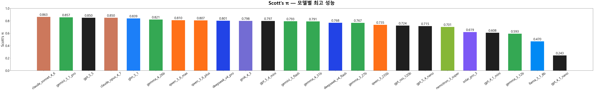
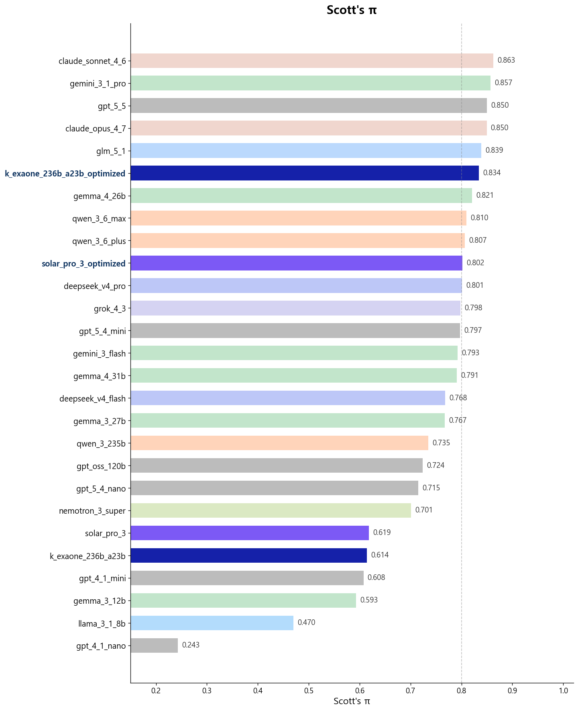

# judge-model-evaluation

**LLM-as-a-Judge 파이프라인에서, judge 모델이 실제로 믿을 만한지 측정합니다.**

AI가 생성한 답변을 사람 대신 LLM이 채점하는 방식은 이제 흔합니다. 그런데 그 채점자(judge)가 편향되어 있거나 프롬프트 표현 하나에 흔들린다면, 모든 평가 결과가 잘못된 신호가 됩니다.

이 도구는 **judge 모델 자체를 평가**합니다. 인간이 직접 라벨링한 정답 데이터를 기준으로, 각 judge가 얼마나 정확하고 안정적인지를 측정합니다.

## Core Features

- **어떤 judge를 파이프라인에 올려야 하는지** — 모델별 신뢰도 순위
- **왜 특정 judge가 위험한지** — 관대한 편향(FPR), 엄격한 편향(FNR), 프롬프트 민감도
- **비용 대비 신뢰도** — 소형 모델이 대형 모델을 대체할 수 있는지

## Evaluation Result



Scott's Pi: judge 모델의 판단이 인간 라벨과 얼마나 일치하는지를 측정하는 지표 (1.0 = 완전 일치, 0.0 = 랜덤 수준)

[평가 결과 전체 리포트](https://htmlpreview.github.io/?https://github.com/00dhkim/judge-model-evaluation/blob/main/outputs/merged_report.html)

### Optimized Result



[최적화 포함 전체 리포트](https://htmlpreview.github.io/?https://github.com/00dhkim/judge-model-evaluation/blob/main/outputs/merged_report_optimized.html)

## 빠른 시작

```bash
uv venv && uv sync

uv run judge-eval prepare-data configs/examples/frontier_latest_202605.yaml
uv run judge-eval run        configs/examples/frontier_latest_202605.yaml
uv run judge-eval metrics    outputs/<output_dir>
uv run judge-eval report     outputs/<output_dir>
```

여러 실험을 하나의 리포트로 합치기:

```bash
uv run judge-eval merge outputs/exp1 outputs/exp2 --output outputs/merged_report.html
```

벤치마크 실행을 위한 세부 내용은 [guide.md](guide.md)를 참고하세요.

최적화 방법론은 [optimization.md](optimization.md)를 참고하세요.
