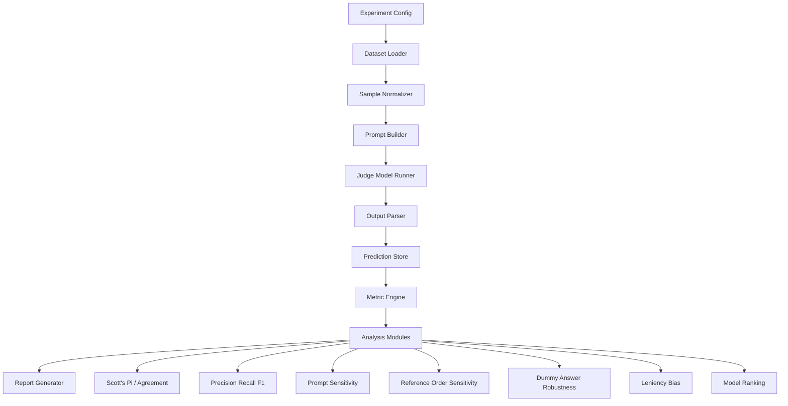

# Product Requirements Document

## LLM-as-a-Judge Meta-Evaluation System

### 1. 배경

LLM-as-a-judge는 사람 평가 비용을 줄이는 유력한 방법이지만, judge 모델 자체도 틀릴 수 있다. `Judging the Judges` 논문은 judge 모델들이 인간 평가와 얼마나 일치하는지, 그리고 prompt length, reference order, leniency bias, dummy answer 등에 얼마나 취약한지를 분석했다. 특히 percent agreement만으로는 judge 품질을 제대로 구분하기 어렵고, Scott’s π 같은 chance-corrected agreement 지표가 더 유용하다고 보고했다. ([arXiv][1])

본 시스템은 이 논문의 meta-evaluation 방식을 제품화한다. 단, 원논문 TriviaQA 실험 CSV에는 실제 exam-taker answer가 누락된 것으로 보이므로, candidate answer와 human label이 명시적으로 포함된 QA-Eval / EVOUNA를 사용한다. EVOUNA는 Natural Questions와 TriviaQA 기반 Open-QA 평가 데이터셋이며, 각 row에 question, golden answer, 여러 모델의 generated answer, 그리고 사람이 매긴 correctness label이 들어 있다. ([GitHub][2])

### 2. 목표

이 시스템의 목표는 사용자가 judge 후보 모델 목록과 모델 가중치 또는 API endpoint를 입력하면, 각 judge 모델이 Open-QA correctness judge로서 얼마나 인간 판단과 일치하는지 자동 산출하는 것이다.

최종 산출물은 단순 accuracy가 아니다. 각 judge 모델별 judge score, percent agreement, Scott’s π, precision, recall, F1, false positive/false negative, exam-answer-source별 성능, dataset별 성능, prompt sensitivity, dummy-answer robustness, leniency bias 분석까지 포함해야 한다.

### 3. 비목표

이 시스템은 RAG faithfulness 평가 시스템이 아니다. EVOUNA에는 retrieved context나 citation evidence가 없으므로 “답변이 검색 문서에 근거했는가”는 평가할 수 없다. 이 시스템은 우선 “질문 + 정답 후보 + candidate answer를 보고 candidate answer가 정답인지 판단하는 능력”을 평가한다.

또한 이 시스템은 새로운 human annotation을 생성하지 않는다. 비용 절감을 위해 EVOUNA의 기존 `judge_*` human label을 gold label로 사용한다.

### 4. 핵심 사용자 시나리오

사용자는 다음과 같은 설정 파일을 입력한다.

```yaml
experiment_name: judge_eval_2026_04
datasets:
  - name: evouna_tq
    path: data/EVOUNA/TQ.json
  - name: evouna_nq
    path: data/EVOUNA/NQ.json

filter:
  improper: false

judge_models:
  - name: qwen3_32b
    provider: vllm
    model_path: /models/Qwen3-32B
    endpoint: http://localhost:8000/v1/chat/completions
  - name: gpt_4_1
    provider: openai_compatible
    model: gpt-4.1
    endpoint: ${OPENAI_BASE_URL}
    api_key_env: OPENAI_API_KEY

output:
  dir: outputs/judge_eval_2026_04
  save_raw_predictions: true
  save_report: true

telemetry:
  enabled: true
  provider: arize
```

시스템은 EVOUNA 데이터를 읽고, 각 row를 `answer_* / judge_*` 쌍으로 펼친다. 예를 들어 하나의 row는 `answer_fid`, `answer_gpt35`, `answer_chatgpt`, `answer_gpt4`, `answer_newbing`의 5개 평가 샘플로 변환된다. EVOUNA README는 이 컬럼 구조와 `judge_*`가 human correctness label임을 명시한다. ([GitHub][2])

그다음 각 judge 후보 모델에게 다음 입력을 준다. 출력은 structured output으로 reason을 먼저, label을 나중에 내도록 강제한다.

```text
Question:
{question}

Golden answer(s):
{golden_answer}

Candidate answer:
{candidate_answer}

Task:
Determine whether the candidate answer correctly answers the question.
Return only JSON:
{"reason": "brief explanation", "label": true} or {"reason": "brief explanation", "label": false}
```

출력된 `reason`과 `label`을 모두 저장하되, 성능 계산은 `label`을 EVOUNA의 human label인 `judge_*`와 비교하여 수행한다.

### 5. 데이터 요구사항

입력 데이터는 EVOUNA의 `TQ.json`, `NQ.json`을 기본으로 한다. 각 data point는 `question`, `golden_answer`, `answer_fid`, `answer_gpt35`, `answer_chatgpt`, `answer_gpt4`, `answer_newbing`, `judge_fid`, `judge_gpt35`, `judge_chatgpt`, `judge_gpt4`, `judge_newbing`, `improper` 필드를 가진다. ([GitHub][2])

`improper=true`인 샘플은 제외한다. 실제 EVOUNA에는 시간 의존적이거나 부적절한 문제에 대해 `judge_*`가 `"nan"`으로 들어간 row가 있다. 예를 들어 Australia population 문제는 `improper: true`이고 여러 `judge_*` 값이 `"nan"`으로 표기된다. ([GitHub][3])

정규화 후 내부 표준 스키마는 다음과 같다.

```json
{
  "sample_id": "TQ_000001_gpt4",
  "dataset": "TQ",
  "question": "What star sign is Jamie Lee Curtis?",
  "golden_answer": "Scorpio/Skorpio/Scorpio (disambiguation)",
  "answer_source": "gpt4",
  "candidate_answer": "Jamie Lee Curtis was born on November 22, which makes her a Sagittarius.",
  "human_label": false,
  "improper": false
}
```

### 6. 시스템 입력

시스템은 네 가지 입력을 받는다.

첫째, judge model 목록이다. 각 모델은 `name`, `provider`, `endpoint`, `model`, `model_path`, `api_key_env`, `temperature`, `max_tokens`를 가질 수 있다.

둘째, dataset 설정이다. 기본값은 `EVOUNA/TQ.json`과 `EVOUNA/NQ.json`이다. 사용자는 `TQ only`, `NQ only`, `sample_size`, `seed`, `answer_sources`를 지정할 수 있어야 한다.

셋째, evaluation 설정이다. prompt template, retry 횟수, output parser, invalid output 처리 방식, metric list, bootstrap 반복 횟수, prompt sensitivity test 여부, dummy answer test 여부를 받는다.

넷째, observability 설정이다. OpenTelemetry tracing on/off와 experiment naming rule을 받는다. Arize 인증은 설정 파일에서 env 이름을 다시 받지 않고, 프로세스 환경의 `ARIZE_API_KEY`, `ARIZE_SPACE_ID`를 고정적으로 사용한다. 둘 중 하나라도 없으면 설정 검증 단계에서 에러를 발생시켜야 한다.

### 7. 시스템 출력

시스템은 최소 다음 파일을 생성해야 한다.

```text
outputs/{experiment_name}/
  config.resolved.yaml
  normalized_samples.parquet
  raw_predictions.jsonl
  parsed_predictions.parquet
  telemetry_manifest.json
  metrics_overall.csv
  metrics_by_dataset.csv
  metrics_by_answer_source.csv
  confusion_matrices.json
  scotts_pi.csv
  prompt_sensitivity.csv
  reference_order_sensitivity.csv
  dummy_answer_robustness.csv
  leniency_bias.csv
  model_rankings.csv
  report.md
```

`report.md`에는 Judge 모델 별 성능 그래프(Percent Agreement, Precision, Recall, F1, Scott's Pi), 기타 수치 그래프(비용, 속도), 최종 추천 모델, 모델별 약점, 운영 투입 가능 여부, 비용/속도/성능 trade-off가 포함되어야 한다. 또한 Arize에서 동일 실험의 모델별 성능 비교와 trace/span drill-down이 가능해야 한다.

### 8. 주요 기능 요구사항

#### 8.1 Dataset Loader

EVOUNA JSON을 읽고 표준 평가 샘플로 펼친다. 각 row에서 `answer_fid/judge_fid`, `answer_gpt35/judge_gpt35`, `answer_chatgpt/judge_chatgpt`, `answer_gpt4/judge_gpt4`, `answer_newbing/judge_newbing`을 각각 독립 샘플로 만든다.

필수 검증은 다음과 같다. `human_label`이 boolean이 아니면 제외한다. `improper=true`이면 기본 제외한다. `candidate_answer`가 비어 있거나 `"None"`이면 설정에 따라 제외하거나 false candidate로 유지한다. `golden_answer`는 `/`로 나뉜 alias 집합으로 보존하되, judge prompt에는 원문 문자열과 alias list를 함께 제공할 수 있어야 한다.

#### 8.2 Judge Model Runner

각 judge 모델에 동일한 샘플을 동일한 prompt family로 넣는다. temperature는 기본 0으로 둔다. 출력은 반드시 reason-first JSON으로 파싱한다.

invalid output 처리 정책은 강해야 한다. 최종 `label=true/false`를 파싱할 수 없으면 1회 retry한다. 그래도 실패하면 `invalid`로 저장하고 워닝을 발생하며 metric 계산에서는 별도 집계한다. invalid를 임의로 false로 바꾸면 안 된다. 그건 평가 왜곡이다. `reason`은 raw output과 함께 저장해야 하며, `label`보다 먼저 생성되었는지 audit 가능해야 한다.

#### 8.3 Prompt Template Manager

최소 3개 prompt를 지원한다.

`minimal`: 질문, golden answer, candidate answer만 제공한다.
`guideline`: correctness 기준을 자세히 제공한다.
`guideline_with_examples`: correct/incorrect 예시를 포함한다.

이 기능은 필수다. `Judging the Judges` 논문은 judge 모델이 prompt length와 specificity에 민감할 수 있음을 보였고, 상위 모델은 상대적으로 안정적이지만 작은 모델은 긴 지시문에서 오히려 성능이 떨어질 수 있다고 분석했다. ([arXiv][1])

#### 8.4 Output Parser

모델 출력은 다음 세 방식으로 파싱한다.

1차: JSON parse
2차: regex parse, 예: `"label": true`, `true`, `correct`
3차: invalid 처리

단, 2차 regex parse를 허용하더라도 raw output은 반드시 저장해야 한다. 모델이 reason을 먼저 설명하고 마지막에 label을 내도록 요구하므로, parser가 무엇을 근거로 label을 뽑았는지 audit 가능해야 한다.

#### 8.5 Metric Engine

기본 metric은 다음이다.

`judge_score`: judge 모델이 correct라고 판정한 비율이다. 논문의 judge score card와 대응된다.
`human_score`: human label 기준 correct 비율이다.
`score_delta`: judge_score - human_score다. 양수면 lenient, 음수면 strict 경향이다.
`percent_agreement`: judge label과 human label이 일치한 비율이다.
`Scott’s π`: chance agreement를 보정한 agreement 지표다. 논문은 percent agreement보다 Scott’s π가 judge 모델 차이를 더 잘 구분한다고 보고했다. ([arXiv][1])
`precision`: judge가 true라고 한 것 중 human true 비율이다.
`recall`: human true 중 judge가 true로 잡은 비율이다.
`F1`: precision과 recall의 조화평균이다.
`TP/FP/TN/FN`: confusion matrix다.
`FPR`: human false인데 judge true인 비율이다.
`FNR`: human true인데 judge false인 비율이다.

Scott’s π는 다음으로 계산한다.

```text
Po = observed agreement
Pe = sum_c p_c^2

p_c = pooled class proportion for class c across both raters
Scott’s π = (Po - Pe) / (1 - Pe)
```

binary label에서는 class가 `true`, `false` 두 개다.

#### 8.6 Stratified Analysis

전체 평균만 내면 안 된다. 최소 다음 축으로 쪼개야 한다.

`dataset`: TQ vs NQ
`answer_source`: fid, gpt35, chatgpt, gpt4, newbing
`human_label`: true vs false
`answer_length_bucket`: short, medium, long
`golden_answer_alias_count`: alias가 많은 문제 vs 적은 문제
`model_family`: 사용자가 입력한 metadata 기준

이유는 명확하다. judge 모델은 명백한 오답은 잘 잡아도 under-specified answer나 부분정답을 놓칠 수 있다. `Judging the Judges` 논문도 incorrect entity는 잘 잡지만 under-specified answer recall은 크게 낮다는 분석을 제시했다. ([arXiv][1])

#### 8.7 Prompt Sensitivity Test

동일 sample에 대해 prompt template을 바꿔 평가한다. 모델별로 다음을 계산한다.

```text
prompt_consistency = same prediction across templates / total samples
scotts_pi_by_prompt
metric_delta_between_prompts
```

좋은 judge 모델은 prompt가 조금 바뀌어도 판단이 크게 흔들리지 않아야 한다.

#### 8.8 Reference Order Sensitivity Test

`golden_answer`가 `/`로 여러 alias를 갖는 경우 alias 순서를 shuffle한다. 같은 question, 같은 candidate answer에서 golden answer 순서만 바꿔 3회 평가한다.

측정값은 다음이다.

```text
reference_order_consistency
label_flip_rate_by_reference_order
```

원논문은 reference order 변화가 일부 judge 모델의 판단에 영향을 줄 수 있다고 보고했다. ([arXiv][1])

#### 8.9 Dummy Answer Robustness Test

논문식 controlled response test를 EVOUNA에 맞게 구현한다. 각 question에 대해 다음 dummy answer를 만든다.

```text
gold_answer_verbatim: golden_answer의 첫 alias
yes: "Yes"
sure: "Sure"
repeat_question: question 그대로
empty: ""
```

기대 label은 `gold_answer_verbatim=true`, 나머지는 기본적으로 false다. 단, yes/no 질문에서는 `Yes`가 실제 정답일 가능성이 있으므로 별도 제외하거나 caution flag를 붙인다. 원논문은 “Yes”, “Sure” 같은 dummy answer가 일부 judge를 속일 수 있음을 보였다. ([arXiv][1])

#### 8.10 Leniency Bias Analysis

모델이 답을 쉽게 맞다고 해주는지 본다. 최소 지표는 다음이다.

```text
positive_rate = judge true 비율
human_positive_rate = human true 비율
leniency_delta = positive_rate - human_positive_rate
false_positive_rate
score_delta
```

`Judging the Judges` 논문은 LLM judge가 확신이 없을 때 positive 쪽으로 기우는 경향이 있고, 특히 작은 모델에서 더 두드러질 수 있다고 보고했다. ([arXiv][1])

#### 8.11 Model Ranking

원 논문 형태를 따라, 여러 관점의 ranking을 각각 산출하고 그래프로 제공하여 최종 보고서에 담는다. 즉 “최종 1등 모델”을 하나로 강제하지 않고, 어떤 기준에서 어떤 judge가 강한지 분리해서 보여준다.

Primary ranking은 Scott’s π 기준이다. 각 judge 모델의 예측 label과 human label의 chance-corrected agreement를 계산하고, Scott’s π가 높은 순서로 정렬한다. 이 ranking이 judge-human alignment의 핵심 결과다.

Secondary ranking은 다음 지표별로 각각 산출한다.
```
1. Percent agreement ranking
   - judge label과 human label의 단순 일치율

2. Absolute score gap ranking
   - |judge_score - human_score|
   - judge_score는 judge가 correct라고 판정한 비율
   - human_score는 human label 기준 correct 비율
   - 낮을수록 좋음

3. False positive rate ranking
   - human false인데 judge true로 판정한 비율
   - 낮을수록 좋음
   - 운영 gate 관점에서 중요

4. False negative rate ranking
   - human true인데 judge false로 판정한 비율
   - 낮을수록 좋음

5. Precision ranking
   - judge가 true라고 한 것 중 실제 human true 비율

6. Recall ranking
   - human true 중 judge가 true로 맞춘 비율

7. F1 ranking
   - precision과 recall의 조화평균

8. Prompt sensitivity ranking
   - prompt template 변화에 따른 label flip rate
   - 낮을수록 좋음

9. Dummy answer robustness ranking
   - “Yes”, “Sure”, question repeat, empty answer 등 dummy response를 얼마나 잘 reject하는지
   - 높을수록 좋음

10. Reference order sensitivity ranking
   - golden answer alias 순서를 바꿨을 때 label이 뒤집히는 비율
   - 낮을수록 좋음
```

또한 exam-taker answer source별 ranking을 별도로 제공한다. EVOUNA의 `answer_fid`, `answer_gpt35`, `answer_chatgpt`, `answer_gpt4`, `answer_newbing` 각각에 대해 judge 모델 성능을 나누어 계산한다. 이는 judge가 약한 모델의 명백한 오답만 잘 잡는지, 강한 모델의 미묘한 오답도 잘 잡는지 확인하기 위함이다.

#### 8.12 Visual Graph

그래프는 최소 다음을 포함한다.
```
- Judge model별 Scott’s π bar chart
- Judge model별 percent agreement bar chart
- Judge score vs human score scatter plot
- Judge model별 score gap bar chart
- Precision/Recall/F1 grouped bar chart
- False positive / false negative rate grouped bar chart
- Prompt sensitivity heatmap
- Dummy answer robustness bar chart
- Answer source별 Scott’s π heatmap
```

### 9. 비기능 요구사항

재현성이 중요하다. 모든 실행은 `config.resolved.yaml`, dataset hash, prompt template version, model name, endpoint, decoding parameter, git commit hash를 저장해야 한다.

비용 통제가 필요하다. 모델별 token usage, total cost estimate, latency p50/p95, throughput을 기록해야 한다.

장애 복구가 가능해야 한다. 각 sample-model 호출 결과를 JSONL로 append 저장하고, 실패 시 이미 완료된 sample은 skip할 수 있어야 한다.

운영 관측성도 필수다. 모든 실행은 OpenTelemetry trace/span을 남겨야 하고, Arize에서 experiment 단위로 모델별 성능과 trace/span을 함께 볼 수 있어야 한다. 필요한 인증 정보는 프로세스 환경의 `ARIZE_API_KEY`, `ARIZE_SPACE_ID`를 고정적으로 사용하며, 값이 없으면 실행 전에 에러를 발생시켜야 한다.

보안 측면에서는 API key를 config에 직접 저장하면 안 된다. 환경변수 참조만 허용한다. 로컬 모델 weight path는 로그에 남겨도 되지만, 외부 API key와 bearer token은 redaction해야 한다.

실행 환경은 `uv`를 기준으로 한다. 프로젝트 가상환경은 `uv venv`로 만들고, CLI와 테스트는 `uv run`으로 실행한다.

### 10. 아키텍처



### 11. 내부 데이터 모델

`EvaluationSample`

```python
class EvaluationSample(BaseModel):
    sample_id: str
    dataset: Literal["TQ", "NQ"]
    question: str
    golden_answer: str
    golden_aliases: list[str]
    answer_source: Literal["fid", "gpt35", "chatgpt", "gpt4", "newbing"]
    candidate_answer: str
    human_label: bool
    improper: bool
    metadata: dict = {}
```

`JudgeModelConfig`

```python
class JudgeModelConfig(BaseModel):
    name: str
    provider: Literal["openai_compatible", "vllm", "hf_local", "custom_http"]
    model: str | None = None
    model_path: str | None = None
    endpoint: str | None = None
    api_key_env: str | None = None
    temperature: float = 0.0
    max_tokens: int = 32
    timeout_sec: int = 120
```

`JudgePrediction`

```python
class JudgePrediction(BaseModel):
    experiment_id: str
    sample_id: str
    judge_model: str
    prompt_template: str
    raw_output: str
    judge_reason: str | None
    parsed_label: bool | None
    parse_status: Literal["ok", "retry_ok", "invalid", "error"]
    latency_ms: int | None
    input_tokens: int | None
    output_tokens: int | None
    trace_id: str | None
    span_id: str | None
    error_message: str | None = None
```

### 12. CLI 요구사항

최소 CLI는 다음과 같다.

```bash
uv venv
uv run judge-eval validate-config configs/exp.yaml
uv run judge-eval prepare-data configs/exp.yaml
uv run judge-eval run configs/exp.yaml
uv run judge-eval metrics outputs/exp_name
uv run judge-eval report outputs/exp_name
```

샘플링 실행도 지원해야 한다.

```bash
uv run judge-eval run configs/exp.yaml --sample-size 200 --seed 42
uv run judge-eval run configs/exp.yaml --models qwen3_32b,gpt_4_1
uv run judge-eval run configs/exp.yaml --resume
```

### 13. Report 요구사항

리포트 첫 페이지에는 다음이 있어야 한다.

```text
Best overall judge:
Best strict-gate judge:
Best low-cost judge:
Most lenient judge:
Most conservative judge:
Most prompt-sensitive judge:
Worst dummy-answer robustness:
```

또한 telemetry 요약 섹션에는 Arize experiment 이름, 비교 대상 judge 모델 목록, 대표 trace/span 링크 규칙이 포함되어야 한다.

모델별 표는 다음 컬럼을 가져야 한다.

```text
model
n_samples
valid_rate
judge_score
human_score
score_delta
percent_agreement
scotts_pi
precision
recall
f1
fpr
fnr
prompt_consistency
dummy_robustness
avg_latency_ms
estimated_cost
composite_score
rank
```

### 14. 품질 기준

MVP 완료 기준은 다음이다.

EVOUNA TQ/NQ를 정상 로드하고, `improper=false`만 필터링할 수 있어야 한다. 각 row를 5개 candidate answer sample로 펼쳐야 한다. 최소 2개 judge 모델에 대해 end-to-end 실행이 가능해야 한다. raw output, judge reason, parsed label, metric, report가 저장되어야 한다. Scott’s π, percent agreement, precision, recall, F1, confusion matrix가 계산되어야 한다. `uv run` 기반 실행과 기본 OpenTelemetry trace export도 동작해야 한다.

MVP 이후 v1 기준은 prompt sensitivity, dummy answer robustness, leniency bias, reference order sensitivity까지 포함해야 한다.

### 15. 검증 계획

단위 테스트는 dataset loader, alias splitter, label parser, Scott’s π 계산, confusion matrix 계산에 대해 작성한다.

통합 테스트는 작은 fixture를 만든다. 예를 들어 10개 EVOUNA sample과 dummy judge 2개를 사용한다. 하나는 항상 true, 하나는 human label을 그대로 반환하게 만든다. human label 그대로 반환하는 dummy judge는 accuracy/F1/Scott’s π가 1에 가까워야 한다. 항상 true judge는 human positive rate에 따라 높은 percent agreement를 보일 수 있지만 Scott’s π와 FPR에서 약점이 드러나야 한다.

회귀 테스트는 동일 config, 동일 seed, 동일 모델 응답 캐시를 사용했을 때 metrics가 동일하게 재현되는지 확인한다.

### 16. 리스크

가장 큰 리스크는 EVOUNA가 Open-QA correctness 데이터라는 점이다. 이 결과가 RAG faithfulness judge 성능을 보장하지 않는다. 따라서 이 시스템에서 1등한 judge를 내부 RAG hallucination judge로 바로 쓰면 안 된다.

두 번째 리스크는 golden answer alias 품질이다. EVOUNA의 `golden_answer`는 `/`로 연결된 alias 목록인데, 일부 alias가 과도하게 넓거나 오래된 지식을 포함할 수 있다. 실제 TQ 예시에서도 오래된 Libya flag 관련 항목처럼 시점 변화가 있는 문제가 보인다. ([GitHub][3])

세 번째 리스크는 judge prompt overfitting이다. 특정 prompt에서 잘하는 모델이 다른 prompt에서는 흔들릴 수 있다. 그래서 prompt sensitivity test는 선택 기능이 아니라 v1 필수 기능으로 봐야 한다.

### 17. 구현 우선순위

MVP는 2주 내 구현 가능한 범위로 잡는다.

1주차에는 EVOUNA loader, sample normalizer, judge runner, parser, 기본 metric engine을 구현한다.

2주차에는 report generator, model ranking, resume/caching, config validation, 최소 테스트를 구현한다.

v1에서는 prompt sensitivity, dummy answer robustness, reference order sensitivity, leniency bias, bootstrap confidence interval을 추가한다.

### 18. 최종 판단 기준

이 시스템에서 “좋은 judge”는 다음 조건을 만족해야 한다.

첫째, Scott’s π가 높아야 한다. percent agreement가 높아도 class imbalance 때문에 착시가 생길 수 있다.

둘째, false positive가 낮아야 한다. 틀린 답을 맞다고 통과시키는 judge는 운영 gate로 부적절하다.

셋째, prompt와 reference order에 안정적이어야 한다. 작은 문구 변화에 label이 흔들리면 judge로 쓰기 어렵다.

넷째, dummy answer에 속지 않아야 한다. “Yes”, “Sure”, 질문 반복 같은 답을 correct로 주는 모델은 탈락이다.

다섯째, 목적별 ranking이 가능해야 한다. offline benchmark용 최적 judge와 production guardrail용 최적 judge는 다를 수 있다.

[1]: https://arxiv.org/html/2406.12624v4 "Judging the Judges: Evaluating Alignment and Vulnerabilities in LLMs-as-Judges"
[2]: https://github.com/wangcunxiang/qa-eval "GitHub - wangcunxiang/QA-Eval: The repository for paper <Evaluating Open-QA Evaluation> · GitHub"
[3]: https://raw.githubusercontent.com/wangcunxiang/QA-Eval/main/EVOUNA/TQ.json "raw.githubusercontent.com"
